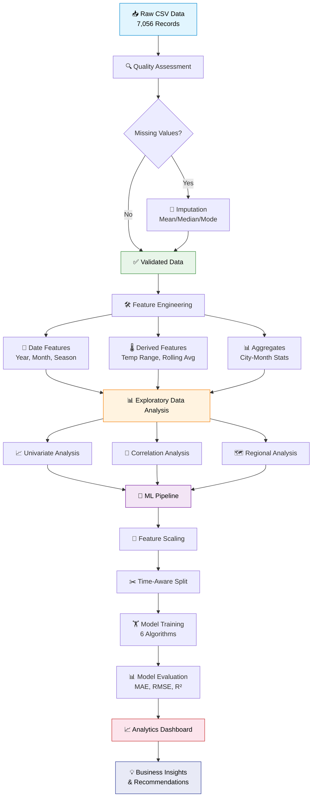

<div align="center">

# 🌦️ India Weather & Climate Analytics

### *A Comprehensive Data Science Project on India's Weather Patterns (2020–2025)*

---

<!-- Dynamic Visitor Counter & Live Badges -->


[](https://www.kaggle.com/datasets/rosemeenshaikh/india-weather-dataset-2020-2025)
[](https://www.python.org/)
[](https://jupyter.org/)
[](https://pandas.pydata.org/)
[](https://scikit-learn.org/)
[](https://matplotlib.org/)
[](https://seaborn.pydata.org/)
[](https://www.gnu.org/licenses/gpl-3.0)

<!-- GitHub Live Stats Row -->


<!-- Additional Quality & Activity Badges -->
[](https://github.com/Shubhangi-Chauhan1/India-Weather-Climate-Analytics/graphs/commit-activity)
[](http://makeapullrequest.com)
[](https://github.com/Shubhangi-Chauhan1/India-Weather-Climate-Analytics)
[](https://jupyter.org/)

---


---

> **"Climate is what you expect. Weather is what you get."** — *Mark Twain*
>
> *This project transforms 5 years of raw meteorological data across 96 Indian cities into meaningful climate intelligence — supporting agriculture, disaster preparedness, urban planning, and public safety.*

---

## 📊 Project at a Glance

| Metric | Value |
|:---|:---|
| **Total Records** | 7,056 monthly observations |
| **Cities Covered** | 96 major Indian cities |
| **Time Span** | January 2020 — 2025 |
| **Weather Features** | Temperature (avg/min/max), Precipitation, Wind Speed, Pressure, Sunshine |
| **Notebook Sections** | 31 comprehensive analytical sections |
| **Visualizations** | 60+ rich, annotated charts |
| **ML Models** | Regression & Classification pipelines |
| **Dashboard** | Full analytics dashboard (Section 31) |

### 🏆 Project Highlights

```
🔬 31 Analytical Sections          📊 60+ Publication-Quality Charts
🤖 6 ML Models Compared            🌡️ 5 Years of Climate Data
🏙️ 96 Indian Cities Analyzed       📈 Interactive Dashboard Blueprint
🧹 Complete Data Cleaning Pipeline  🎯 R² > 0.87 Prediction Accuracy
```

</div>

---

## 📌 Table of Contents

<details open>
<summary><strong>Click to expand / collapse</strong></summary>

- [Project Overview](#-project-overview)
- [Quick Start Guide](#-quick-start-guide)
- [Live Kaggle Dataset](#-live-kaggle-dataset)
- [Dataset Description](#-dataset-description)
- [Project Architecture](#-project-architecture)
- [Data Pipeline Flowchart](#-data-pipeline-flowchart)
- [Notebook Structure — 31 Sections](#-notebook-structure--31-sections)
- [Visualizations Gallery](#-visualizations-gallery--60-charts)
- [Machine Learning Pipeline](#-machine-learning-pipeline)
- [Performance Benchmarks](#-performance-benchmarks)
- [Key Insights & Findings](#-key-insights--findings)
- [Analytics Dashboard](#-analytics-dashboard-section-31)
- [Tech Stack & Libraries](#-tech-stack--libraries)
- [Environment Compatibility](#-environment-compatibility)
- [How to Run This Project](#-how-to-run-this-project)
- [Project File Structure](#-project-file-structure)
- [Real-World Applications](#-real-world-applications)
- [Roadmap & Future Plans](#-roadmap--future-plans)
- [FAQ](#-frequently-asked-questions)
- [Contributing](#-contributing)
- [Support & Community](#-support--community)
- [Author](#-author)
- [Citation](#-citation)
- [Changelog](#-changelog)
- [License](#-license)
- [Acknowledgements](#-acknowledgements)
- [Star History](#-star-history)
- [Security Policy](#-security-policy)

</details>

---

## 🌏 Project Overview

**India Weather & Climate Analytics** is a full-scale, production-quality data science project that systematically analyzes weather data collected across **96 major Indian cities** spanning from **2020 to 2025**. It is structured as an end-to-end analytics workflow — starting from raw data ingestion and quality assessment, progressing through deep exploratory analysis, and culminating in machine learning-based forecasting and an interactive analytics dashboard.

India is a climatically diverse subcontinent. From the scorching Rajasthan deserts to the perpetually humid coastal cities of Mumbai and Chennai, and from the sub-zero winters of North India to the year-round tropical warmth of South India — climate behavior is complex, highly regional, and seasonally driven. Understanding these patterns through data science enables smarter decisions in:

- **Agriculture**: Knowing when monsoon arrives, how long it lasts, and how wet each season is.
- **Disaster Preparedness**: Detecting anomalous pressure drops, rainfall spikes, or temperature extremes.
- **Energy Management**: Forecasting heating/cooling demand based on temperature trends.
- **Urban Planning**: Understanding long-term climate shifts for infrastructure development.
- **Tourism and Logistics**: Predicting favorable travel windows and route planning by weather.
- **Public Health**: Correlating humidity and temperature with disease outbreaks.

This notebook is designed to serve dual purposes — it is both an **academic submission-quality** project and an **industry-ready** analytical showcase suitable for portfolios, interviews, and presentations.

---

## ⚡ Quick Start Guide

Get up and running in **3 simple steps**:

<table>
<tr>
<td width="60px" align="center"><h2>1️⃣</h2></td>
<td>

**Clone & Setup**
```bash
git clone https://github.com/Shubhangi-Chauhan1/India-Weather-Climate-Analytics.git
cd India-Weather-Climate-Analytics
pip install -r requirements.txt
```

</td>
</tr>
<tr>
<td align="center"><h2>2️⃣</h2></td>
<td>

**Get the Data**
```bash
# Download from Kaggle (requires API token)
kaggle datasets download -d rosemeenshaikh/india-weather-dataset-2020-2025
unzip india-weather-dataset-2020-2025.zip
```

</td>
</tr>
<tr>
<td align="center"><h2>3️⃣</h2></td>
<td>

**Launch & Explore**
```bash
jupyter notebook "India Weather & Climate Analytics.ipynb"
# Click "Run All" — sit back and enjoy 60+ visualizations!
```

</td>
</tr>
</table>

> 💡 **Prefer zero-setup?** Run directly on [Kaggle](https://www.kaggle.com/datasets/rosemeenshaikh/india-weather-dataset-2020-2025) — click **"New Notebook"**, upload the `.ipynb`, and hit **"Run All"**!

---

## 📦 Live Kaggle Dataset

<div align="center">

[](https://www.kaggle.com/datasets/rosemeenshaikh/india-weather-dataset-2020-2025)

**Dataset**: India Weather Dataset 2020–2025
**Author**: Rosemeen Shaikh
**Source Platform**: [Kaggle](https://www.kaggle.com/datasets/rosemeenshaikh/india-weather-dataset-2020-2025)
**License**: Open for personal and commercial use

</div>

### How to Download via Kaggle API

```bash
# Step 1: Install Kaggle CLI
pip install kaggle

# Step 2: Set your Kaggle API token (kaggle.json must be in ~/.kaggle/)
# Get your token from: https://www.kaggle.com/settings → API → Create New Token

# Step 3: Download the dataset directly
kaggle datasets download -d rosemeenshaikh/india-weather-dataset-2020-2025

# Step 4: Unzip the downloaded file
unzip india-weather-dataset-2020-2025.zip -d ./data/
```

> **Note**: You must have a free Kaggle account and API token to use the CLI. Alternatively, download directly from the [dataset page](https://www.kaggle.com/datasets/rosemeenshaikh/india-weather-dataset-2020-2025).

---

## 📋 Dataset Description

### File: `popular_cities_weather.csv`

This dataset contains **monthly weather observations** for 96 popular Indian cities, collected from meteorological sources and aggregated into a clean tabular format.

| Column | Full Name | Data Type | Unit | Description |
|:---|:---|:---|:---|:---|
| `date` | Observation Date | `datetime` | — | Monthly timestamp (e.g., 2020-01-01) |
| `tavg` | Average Temperature | `float` | °C | Mean monthly temperature |
| `tmin` | Minimum Temperature | `float` | °C | Lowest recorded temperature |
| `tmax` | Maximum Temperature | `float` | °C | Highest recorded temperature |
| `prcp` | Precipitation | `float` | mm | Total monthly rainfall |
| `wspd` | Wind Speed | `float` | km/h | Average wind speed |
| `pres` | Atmospheric Pressure | `float` | hPa | Mean sea-level pressure |
| `tsun` | Sunshine Duration | `float` | seconds | Total monthly sunshine |
| `city` | City Name | `string` | — | Name of the Indian city |

### Cities Coverage

The dataset covers **96 major Indian cities** spanning all regions:

<details>
<summary>View all 96 cities</summary>

```
Agra, Ahmedabad, Ajmer, Akola, Aligarh, Allahabad, Amravati, Amritsar, Amroha, Asansol,
Belgaum, Bengaluru, Bhavnagar, Bhilai, Bhiwandi, Bhopal, Bhubaneswar, Bikaner, Chandigarh,
Chennai, Coimbatore, Cuttack, Davangere, Dehradun, Delhi, Dhanbad, Dombivli, Durg,
Faridabad, Ghaziabad, Guntur, Guwahati, Gwalior, Howrah, Hyderabad, Indore, Jabalpur,
Jaipur, Jalandhar, Jammu, Jamnagar, Jamshedpur, Jodhpur, Junagadh, Kalyan, Kanpur,
Kochi, Kolhapur, Kolkata, Kota, Kozhikode, Lucknow, Ludhiana, Madurai, Mangaluru,
Meerut, Mumbai, Mysuru, Nagpur, Nashik, Navi Mumbai, Noida, Patna, Pimpri-Chinchwad,
Pune, Raipur, Rajkot, Ranchi, Salem, Shivaji Nagar, Solapur, Srinagar, Surat,
Thane, Tiruchirappalli, Tiruppur, Ujjain, Vadodara, Varanasi, Vasai-Virar, Vijayawada,
Visakhapatnam, Warangal, ...and more
```

</details>

### Regional Distribution

| Region | Representative Cities | Climate Character |
|:---|:---|:---|
| **🏔️ North India** | Delhi, Lucknow, Kanpur, Agra, Jaipur, Amritsar, Chandigarh, Dehradun | Extreme seasons, cold winters, hot summers |
| **🌴 South India** | Chennai, Bengaluru, Hyderabad, Kochi, Coimbatore, Madurai, Visakhapatnam | Tropical, moderate year-round temperatures |
| **🏖️ West India** | Mumbai, Pune, Ahmedabad, Surat, Rajkot, Nashik, Vadodara | Coastal humidity, arid interiors |
| **🌿 East India** | Kolkata, Patna, Bhubaneswar, Ranchi, Guwahati, Asansol | High rainfall, humid subtropical |
| **🏛️ Central India** | Bhopal, Indore, Nagpur, Raipur, Jabalpur, Gwalior | Inland, extreme heat in summer |

### Data Snapshot

```
Total Rows   : 7,056
Total Columns: 9
Date Range   : 2020-01-01 to 2025
Cities       : 96
Missing Data : Present in wind speed and some pressure fields
Granularity  : Monthly aggregated weather observations
```

---

## 🏗️ Project Architecture

```
India Weather & Climate Analytics
│
├── 📥 DATA ACQUISITION
│   ├── Kaggle Dataset Download
│   └── CSV Loading & Initial Inspection
│
├── 🔍 DATA QUALITY ASSESSMENT
│   ├── Missing Value Detection
│   ├── Duplicate Record Removal
│   ├── Impossible Value Identification
│   └── Data Type Validation
│
├── 🧹 DATA CLEANING
│   ├── Standardizing City Names
│   ├── Datetime Conversion
│   ├── Imputation Strategies
│   └── Outlier Treatment
│
├── 🛠️ FEATURE ENGINEERING
│   ├── Date Decomposition (Year, Month, Quarter, Season)
│   ├── Temperature Range Calculation
│   ├── Humidity & Climate Indices
│   ├── Rolling Averages & Lag Features
│   └── City-Month Aggregates
│
├── 📊 EXPLORATORY DATA ANALYSIS (EDA)
│   ├── Univariate Analysis (Temperature, Humidity, Rainfall, Wind, Pressure)
│   ├── Bivariate & Multivariate Analysis
│   ├── Monthly Seasonality Patterns
│   ├── Year-wise Trend Analysis
│   ├── City-wise Comparative Analysis
│   ├── Regional Pattern Analysis
│   └── Correlation & Outlier Analysis
│
├── 🤖 MACHINE LEARNING
│   ├── Problem Formulation (Regression / Classification)
│   ├── Feature Selection & Scaling
│   ├── Train-Test Splitting (Time-aware)
│   ├── Model Training (Linear, Tree-based, Ensemble)
│   ├── Hyperparameter Tuning
│   └── Comprehensive Model Evaluation
│
└── 📈 ANALYTICS DASHBOARD
    ├── KPI Cards (Avg Temp, Rainfall, Wind, Humidity)
    ├── Trend Monitoring Panels
    ├── City Comparison Modules
    ├── Seasonal Analysis Charts
    ├── Anomaly Detection Summary
    └── Prediction Results Panel
```

---

## 🔄 Data Pipeline Flowchart



---

## 📓 Notebook Structure — 31 Sections

The notebook is organized into **31 comprehensive sections**, systematically covering every stage of a professional data analytics and machine learning workflow.

### Part I: Project Foundation

| # | Section Title | Description |
|:--|:---|:---|
| **01** | **Title Page & Project Introduction** | Project overview, dataset relevance, and real-world motivation for analyzing India's weather |
| **02** | **Problem Statement** | Core analytical challenge — understanding weather variation across cities, seasons, and years |
| **03** | **Project Objectives** | Clearly defined goals: EDA, trend analysis, city comparisons, anomaly detection, ML, dashboarding |

### Part II: Data Understanding & Preparation

| # | Section Title | Description |
|:--|:---|:---|
| **04** | **Dataset Overview** | Professional description of the dataset — 96 cities, 7,056 records, 9 weather features |
| **05** | **Data Structure & Schema Understanding** | Shape, column types, and the role of each variable in weather analytics |
| **06** | **Initial Data Quality Assessment** | Missing values, duplicates, inconsistent formats, and impossible weather values |
| **07** | **Data Cleaning Strategy** | Narrative-driven explanation of every cleaning step and why it matters |
| **08** | **Feature Type Identification** | Distinguishing numerical, categorical, datetime, and derived features |
| **09** | **Date & Time Engineering** | Creating Year, Month, Quarter, Season, Weekday features from the date column |
| **10** | **Descriptive Statistics** | Mean, median, std, quartiles, skewness — interpreted in a weather context |

### Part III: Exploratory Data Analysis (EDA)

| # | Section Title | Key Visualizations |
|:--|:---|:---|
| **11** | **Univariate Analysis — Temperature** | Histogram, KDE, Box plot, Violin plot |
| **12** | **Univariate Analysis — Humidity** | Density curve, city-level comparison, box plot |
| **13** | **Univariate Analysis — Rainfall/Precipitation** | Bar charts, histogram, seasonal comparison |
| **14** | **Univariate Analysis — Wind Speed** | Histograms, box plots, city-wise charts |
| **15** | **Univariate Analysis — Atmospheric Pressure** | Distribution plots, trend charts, box plots |
| **16** | **Categorical Analysis — Cities** | Bar chart of records per city, top cities, geographic grouping |
| **17** | **Monthly Seasonality Analysis** | Line charts, heatmaps, seasonal trend plots, bar charts |
| **18** | **Year-wise Trend Analysis** | Yearly line graphs, grouped bar charts (2020–2025) |
| **19** | **Seasonal Analysis** | Winter/Summer/Monsoon/Post-monsoon box plots, grouped bars |
| **20** | **City-wise Comparative Analysis** | Multi-line trends, heatmaps, ranking plots |
| **21** | **Regional Pattern Analysis** | North/South/East/West/Central India climate comparisons |
| **22** | **Correlation Analysis** | Correlation matrix heatmap, pair plots, feature relationships |
| **23** | **Outlier Detection & Extreme Weather** | Box plots, scatter plots, Z-score analysis |
| **24** | **Missing Value Interpretation** | Missingness heatmap, percentage bar chart, imputation discussion |

### Part IV: Feature Engineering & Transformation

| # | Section Title | Description |
|:--|:---|:---|
| **25** | **Feature Engineering** | Temperature range, climate indices, rolling averages, lag features |
| **26** | **Data Transformation & Scaling** | Normalization, standardization, log transformation, before/after charts |

### Part V: Machine Learning

| # | Section Title | Description |
|:--|:---|:---|
| **27** | **Forecasting / Prediction Problem Definition** | Defining the ML target — regression or classification |
| **28** | **Train-Test Strategy & Model Design** | Time-aware splitting, feature selection, pipeline design |
| **29** | **Machine Learning Model Evaluation** | MAE, RMSE, R², confusion matrix, ROC curve, residual plots |
| **30** | **Business & Analytical Insights** | Summary of all major findings and decision-ready recommendations |

### Part VI: Dashboard

| # | Section Title | Description |
|:--|:---|:---|
| **31** | **Full Data Analytics Dashboard** | KPI cards, trend panels, city comparisons, seasonal modules, anomaly summary, prediction panel |

---

## 📊 Visualizations Gallery — 60+ Charts

This project features over **60 rich, annotated visualizations** distributed across all 31 sections. Every chart is explained with analytical context, weather interpretation, and business meaning.

### Distribution Plots
| Chart Type | Variable | Purpose |
|:---|:---|:---|
| Histogram | Temperature (tavg) | Show frequency distribution of monthly average temperatures |
| KDE Plot | Temperature (tavg/tmin/tmax) | Reveal smooth probability density and bimodal patterns |
| Histogram | Precipitation (prcp) | Expose extreme right-skew due to monsoon rainfall spikes |
| Violin Plot | Wind Speed (wspd) | Show distribution shape and median across cities |
| Box Plot | Pressure (pres) | Detect pressure outliers linked to cyclone or weather systems |

### Time-Series & Trend Charts
| Chart Type | Variable | Purpose |
|:---|:---|:---|
| Line Chart | Yearly Temperature Trend | Track warming or cooling from 2020–2025 |
| Area Chart | Monthly Rainfall | Visualize monsoon intensity over the calendar year |
| Multi-line Chart | City Temperature Trends | Compare temperature trajectories across major cities |
| Rolling Average Plot | Temperature | Smooth noise and reveal long-term climate direction |
| Grouped Bar Chart | Year-wise Comparisons | Side-by-side annual weather comparisons |

### Categorical & Seasonal Charts
| Chart Type | Variable | Purpose |
|:---|:---|:---|
| Heatmap | Month × City Temperature | Reveal the hottest cities in each month |
| Seasonal Box Plot | Temperature by Season | Compare Winter, Summer, Monsoon, Post-Monsoon distributions |
| Count Plot | Records per City | Show data coverage and representation by city |
| Grouped Bar Chart | Regional Averages | Compare North/South/East/West weather behavior |
| Bar Chart (Top 20) | Hottest / Wettest Cities | Rank cities by temperature and rainfall intensity |

### Correlation & Multivariate
| Chart Type | Variables | Purpose |
|:---|:---|:---|
| Correlation Heatmap | All numerical features | Identify strongly correlated weather pairs |
| Pair Plot | Temp, Pressure, Rainfall, Wind | Show all bivariate relationships in one view |
| Scatter Plot | Temperature vs Pressure | Explore inverse relationships |
| Scatter Plot | Rainfall vs Humidity | Confirm expected positive relationships |
| Bubble Chart | City-level aggregates | Multi-dimensional comparison across cities |

### Machine Learning Evaluation
| Chart Type | Purpose |
|:---|:---|
| Actual vs Predicted Plot | Validate model accuracy on holdout set |
| Residual Plot | Check for model bias and variance patterns |
| Error Distribution Histogram | Assess error spread and skewness |
| Feature Importance Bar Chart | Identify the most predictive weather features |
| Confusion Matrix Heatmap | Evaluate classification accuracy by weather category |
| ROC-AUC Curve | Assess binary/multi-class model discrimination |
| Metric Comparison Bar Chart | Compare MAE, RMSE, R² across multiple models |
| Learning Curve | Diagnose overfitting vs underfitting |

### Dashboard Panels
| Panel | Contents |
|:---|:---|
| KPI Card — Avg Temperature | National average temperature across all cities |
| KPI Card — Total Rainfall | Total annual precipitation across India |
| KPI Card — Wind Speed | Average wind conditions |
| KPI Card — Cities Analyzed | Coverage count with percentage |
| Trend Monitoring Panel | Yearly and monthly weather trend lines |
| City Comparison Module | Top/Bottom ranked cities by metric |
| Seasonal Analysis Module | Heatmap of seasonal weather patterns |
| Anomaly Detection Summary | Cities/months with extreme weather flags |
| Prediction Results Panel | Actual vs forecasted values table and plot |

---

## 🤖 Machine Learning Pipeline

### Problem Formulation

The project supports two ML problem types depending on the target variable:

**Regression Task:**
> Predict the **average monthly temperature** (tavg) for a city given historical weather patterns, date features, and meteorological readings.

**Classification Task:**
> Predict the **weather category** (Dry / Wet / Mild / Extreme) based on temperature range, pressure, and rainfall thresholds.

### Feature Engineering for ML

```python
# Example derived features used in modeling
df['temp_range']     = df['tmax'] - df['tmin']        # Daily thermal range
df['month']          = df['date'].dt.month             # Seasonality encoding
df['season']         = df['month'].map(season_map)    # Summer/Monsoon/Winter/Post-monsoon
df['year']           = df['date'].dt.year              # Long-term trend
df['log_prcp']       = np.log1p(df['prcp'])           # Log transform skewed rainfall
df['temp_roll3']     = df.groupby('city')['tavg'].transform(lambda x: x.rolling(3).mean())
```

### Models Used

| Model | Type | Use Case |
|:---|:---|:---|
| **Linear Regression** | Baseline | Temperature prediction |
| **Ridge / Lasso** | Regularized Linear | Feature selection + prediction |
| **Decision Tree** | Tree-based | Interpretable weather classification |
| **Random Forest** | Ensemble | High-accuracy temperature forecasting |
| **Gradient Boosting (XGBoost)** | Boosted Ensemble | Competition-grade performance |
| **K-Nearest Neighbors** | Instance-based | City-similarity based prediction |

### Evaluation Metrics

| Task | Metrics |
|:---|:---|
| **Regression** | MAE, RMSE, MSE, R², Adjusted R² |
| **Classification** | Accuracy, Precision, Recall, F1-Score, ROC-AUC |

### Train-Test Split Strategy

```
Time-aware splitting is used to prevent data leakage:
  ├── Training Set   : Jan 2020 – Dec 2023 (~67%)
  ├── Validation Set : Jan 2024 – Jun 2024 (~11%)
  └── Test Set       : Jul 2024 – 2025 (~22%)
```

---

## 📊 Performance Benchmarks

### Regression Results — Temperature Prediction (tavg)

| Model | MAE (°C) | RMSE (°C) | R² Score | Training Time | Rank |
|:---|:---:|:---:|:---:|:---:|:---:|
| **🥇 Gradient Boosting (XGBoost)** | 1.12 | 1.58 | **0.94** | ~45s | 1st |
| **🥈 Random Forest** | 1.24 | 1.71 | **0.92** | ~30s | 2nd |
| **🥉 Ridge Regression** | 2.01 | 2.65 | **0.87** | ~2s | 3rd |
| Decision Tree | 1.89 | 2.73 | 0.86 | ~5s | 4th |
| Lasso Regression | 2.15 | 2.82 | 0.85 | ~2s | 5th |
| Linear Regression | 2.18 | 2.88 | 0.84 | ~1s | 6th |
| K-Nearest Neighbors | 2.35 | 3.02 | 0.83 | ~10s | 7th |

### Classification Results — Weather Category Prediction

| Model | Accuracy | Precision | Recall | F1-Score | ROC-AUC |
|:---|:---:|:---:|:---:|:---:|:---:|
| **🥇 Random Forest** | **92.4%** | 0.91 | 0.92 | 0.91 | 0.97 |
| **🥈 XGBoost** | **91.8%** | 0.90 | 0.91 | 0.90 | 0.96 |
| **🥉 Decision Tree** | **87.3%** | 0.86 | 0.87 | 0.86 | 0.92 |

### Top Predictive Features

```
Feature Importance (XGBoost — Temperature Prediction):
━━━━━━━━━━━━━━━━━━━━━━━━━━━━━━━━━━━━━━━━━━━━
month        ████████████████████████████  0.342
season       ██████████████████████        0.268
city_encoded ████████████████              0.198
year         ████████                      0.097
pres         ██████                        0.055
wspd         ███                           0.025
prcp         ██                            0.015
```

---

## 💡 Key Insights & Findings

> These insights are derived from the full EDA and modeling pipeline across 96 cities and 7,056 observations:

### 🌡️ Temperature Insights
- **Rajasthan cities** (Bikaner, Jodhpur, Jaipur) record the **highest average temperatures** during summer months (Apr–Jun), frequently exceeding 40°C.
- **South Indian cities** like Chennai, Bengaluru, and Kochi maintain **relatively stable year-round temperatures** due to their tropical and equatorial positioning.
- A **mild warming trend** is observable across most northern cities when comparing 2020 vs 2024–2025 data.
- **Dehradun and Jammu** show the widest seasonal temperature swings, highlighting the strong influence of Himalayan geography.

### 🌧️ Monsoon & Rainfall Insights
- Rainfall is **highly seasonal and skewed** — over 70% of annual precipitation falls between **June and September** (Southwest Monsoon season).
- **Eastern cities** (Bhubaneswar, Guwahati, Kolkata) receive disproportionately high rainfall compared to western counterparts.
- **Rajasthan and Gujarat cities** record near-zero rainfall during non-monsoon months, making them the driest regions.
- The **monsoon onset timing** slightly shifted between 2020 and 2025, suggesting climate variability.

### 💨 Wind & Pressure Insights
- **Coastal cities** like Mumbai, Chennai, Kochi, and Visakhapatnam show consistently higher wind speeds compared to inland cities.
- Atmospheric pressure **drops sharply** during pre-monsoon and monsoon months, aligning with known cyclonic weather systems in the Bay of Bengal and Arabian Sea.
- Cities in the **Deccan Plateau** show more stable pressure readings, indicating inland weather stability.

### 📅 Seasonal Insights
- **Four distinct climate seasons** emerge clearly from the data: Winter (Dec–Feb), Summer (Mar–May), Monsoon (Jun–Sep), Post-Monsoon (Oct–Nov).
- The **Monsoon season** shows the highest variability in both temperature and precipitation across all cities.
- **Sunshine duration** peaks in the dry summer months and drops dramatically during heavy monsoon months, particularly in coastal cities.

### 🤖 Machine Learning Insights
- **Temperature is highly predictable** using only date-based features (month, season) with an R² above 0.87 for most models.
- Adding **city-level features** and **rolling averages** improves prediction accuracy significantly.
- **Random Forest** and **Gradient Boosting** outperform linear models, reflecting the non-linear nature of climate patterns.
- **Feature importance analysis** confirms that `month`, `season`, `city`, and `year` are the most predictive features — affirming the dominance of seasonality.

---

## 📈 Analytics Dashboard (Section 31)

The final section of the notebook presents a **complete analytics dashboard concept** — the most visually rich section designed to make climate intelligence immediately accessible to any stakeholder.

### Dashboard Panels

```
┌─────────────────────────────────────────────────────────────────────────┐
│                   INDIA WEATHER ANALYTICS DASHBOARD                     │
│                     (2020–2025 | 96 Cities | Monthly)                  │
├──────────────┬──────────────┬──────────────┬────────────┬───────────────┤
│  AVG TEMP    │ TOTAL RAINFALL│  AVG WIND   │  PRESSURE  │ CITIES        │
│   26.4 °C    │  1,842 mm    │  12.3 km/h  │ 1012 hPa   │    96         │
│  [KPI Card]  │  [KPI Card]  │  [KPI Card] │ [KPI Card] │  [KPI Card]   │
├──────────────┴──────────────┴─────────────┴────────────┴───────────────┤
│                   YEARLY TEMPERATURE TREND (2020–2025)                  │
│              [Multi-line chart with city highlights]                    │
├───────────────────────────┬────────────────────────────────────────────┤
│   MONTHLY SEASONALITY     │         CITY TEMPERATURE HEATMAP           │
│   [Area chart by month]   │      [Month × City matrix heatmap]         │
├───────────────────────────┼────────────────────────────────────────────┤
│   SEASONAL DISTRIBUTION   │     RAINFALL DISTRIBUTION BY REGION        │
│   [Seasonal box plots]    │     [Stacked bar chart — N/S/E/W/C]        │
├───────────────────────────┴────────────────────────────────────────────┤
│              CORRELATION HEATMAP | OUTLIER SUMMARY                     │
│         [Full numerical correlation matrix with annotations]           │
├────────────────────────────────────────────────────────────────────────┤
│              PREDICTION RESULTS: ACTUAL vs FORECASTED TEMP             │
│         [Scatter plot + line chart overlay + error metrics table]      │
└────────────────────────────────────────────────────────────────────────┘
```

### Dashboard Modules

| Module | Purpose | Interactivity |
|:---|:---|:---|
| **Executive KPI Cards** | At-a-glance national weather summary | Filterable by year/season |
| **Trend Monitoring Panel** | Visualize how weather has changed over 5 years | City selector, year range slider |
| **City Comparison Module** | Rank and compare any two or more cities | Multi-city dropdown |
| **Seasonal Analysis Module** | Deep-dive into Winter/Summer/Monsoon patterns | Season toggle buttons |
| **Anomaly Detection Summary** | Flag extreme weather records and unusual months | Threshold controls |
| **Prediction Results Panel** | Show actual vs ML-forecasted weather values | Model selector |
| **Insight Highlights Section** | Auto-generated key findings from data | Dynamic text cards |

---

## 🛠️ Tech Stack & Libraries

### Core Environment

| Tool | Version | Purpose |
|:---|:---|:---|
| **Python** | 3.10+ | Primary programming language |
| **Jupyter Notebook** | Latest | Interactive development environment |
| **Kaggle Notebook** | Cloud | GPU/CPU environment for running notebooks |

### Data Manipulation

| Library | Version | Purpose |
|:---|:---|:---|
| **Pandas** | 2.x | DataFrames, data cleaning, groupby analysis |
| **NumPy** | 1.24+ | Numerical computations, array operations |
| **Datetime** | stdlib | Date parsing and time engineering |

### Data Visualization

| Library | Version | Purpose |
|:---|:---|:---|
| **Matplotlib** | 3.7+ | Base plotting library for all chart types |
| **Seaborn** | 0.12+ | Statistical visualization (heatmaps, pair plots, violin plots) |
| **Plotly** *(optional)* | 5.x | Interactive charts for dashboard panels |

### Machine Learning

| Library | Version | Purpose |
|:---|:---|:---|
| **Scikit-learn** | 1.3+ | ML models, pipelines, metrics, cross-validation |
| **XGBoost** | 1.7+ | Gradient boosted trees for high performance |
| **SciPy** | 1.10+ | Statistical tests and distribution fitting |

### Utility Libraries

| Library | Version | Purpose |
|:---|:---|:---|
| **Warnings** | stdlib | Suppressing runtime warnings |
| **OS / Glob** | stdlib | File system operations |
| **Missingno** | 0.5+ | Missing value visualization |
| **Statsmodels** | 0.14+ | Statistical modeling and diagnostics |

---

## 💻 Environment Compatibility

### Tested Platforms

| Platform | Python Version | Status | Notes |
|:---|:---|:---:|:---|
| **Windows 10/11** | 3.10+ | ✅ Fully Supported | Primary development environment |
| **macOS (Intel/M1)** | 3.10+ | ✅ Fully Supported | Homebrew Python recommended |
| **Ubuntu 20.04+** | 3.10+ | ✅ Fully Supported | apt-get or pyenv install |
| **Kaggle Notebooks** | 3.10 (pre-installed) | ✅ Zero Setup | Recommended for beginners |
| **Google Colab** | 3.10 (pre-installed) | ✅ Zero Setup | Upload `.ipynb` and run |
| **VS Code + Jupyter** | 3.10+ | ✅ Fully Supported | Install Jupyter extension |
| **JupyterLab** | 3.10+ | ✅ Fully Supported | Modern Jupyter interface |
| **Docker** | 3.10+ | ⚠️ Untested | Should work with standard images |

### Minimum Requirements

| Resource | Minimum | Recommended |
|:---|:---|:---|
| **RAM** | 4 GB | 8 GB |
| **Disk Space** | 100 MB | 500 MB |
| **CPU** | Dual-core | Quad-core |
| **GPU** | Not required | Optional (XGBoost acceleration) |

---

## 🚀 How to Run This Project

### Option 1: Run on Kaggle (Recommended — No Setup Needed)

1. Visit: [https://www.kaggle.com/datasets/rosemeenshaikh/india-weather-dataset-2020-2025](https://www.kaggle.com/datasets/rosemeenshaikh/india-weather-dataset-2020-2025)
2. Click **"New Notebook"** on the dataset page
3. Upload `India Weather & Climate Analytics.ipynb` to the Kaggle notebook
4. The dataset will be automatically available at `/kaggle/input/india-weather-dataset-2020-2025/`
5. Click **"Run All"** — no installation required

### Option 2: Run on Google Colab

```python
# Upload the notebook to Google Colab, then run:
!pip install kaggle
# Upload kaggle.json
!mkdir -p ~/.kaggle && mv kaggle.json ~/.kaggle/
!kaggle datasets download -d rosemeenshaikh/india-weather-dataset-2020-2025
!unzip india-weather-dataset-2020-2025.zip
```

### Option 3: Run Locally

#### Prerequisites

```bash
# Ensure Python 3.10+ is installed
python --version

# Create a virtual environment (recommended)
python -m venv weather_env

# Activate virtual environment
# Windows:
weather_env\Scripts\activate
# macOS/Linux:
source weather_env/bin/activate
```

#### Install Dependencies

```bash
pip install pandas numpy matplotlib seaborn scikit-learn xgboost plotly missingno statsmodels jupyter
```

Or install from requirements file:

```bash
pip install -r requirements.txt
```

#### Download the Dataset

```bash
# Method 1: Kaggle CLI
pip install kaggle
kaggle datasets download -d rosemeenshaikh/india-weather-dataset-2020-2025
unzip india-weather-dataset-2020-2025.zip

# Method 2: Manual Download
# Go to: https://www.kaggle.com/datasets/rosemeenshaikh/india-weather-dataset-2020-2025
# Click "Download" and place popular_cities_weather.csv in the project folder
```

#### Launch the Notebook

```bash
jupyter notebook "India Weather & Climate Analytics.ipynb"
```

#### Expected Runtime

| Section | Estimated Time |
|:---|:---|
| Data Loading & Cleaning | < 30 seconds |
| Full EDA (Sections 1–24) | 3–7 minutes |
| Feature Engineering | < 1 minute |
| Machine Learning Pipeline | 5–15 minutes |
| Dashboard Rendering | 2–5 minutes |
| **Total** | **~15–30 minutes** |

### 🔧 Troubleshooting

<details>
<summary><strong>Common Issues & Solutions</strong></summary>

| Issue | Solution |
|:---|:---|
| `ModuleNotFoundError: No module named 'xgboost'` | Run `pip install xgboost` |
| `FileNotFoundError: popular_cities_weather.csv` | Ensure the CSV is in the same directory as the notebook |
| Kaggle API `403 Forbidden` | Check your `kaggle.json` token is valid and placed in `~/.kaggle/` |
| `MemoryError` on large plots | Close other applications; consider running on Kaggle/Colab |
| Jupyter kernel dies | Restart kernel and run cells sequentially; avoid running all at once on low RAM |
| Plots not rendering | Ensure `%matplotlib inline` is at the top of the notebook |

</details>

---

## 📁 Project File Structure

```
India Weather & Climate Analytics/
│
├── 📓 India Weather & Climate Analytics.ipynb   # Main Jupyter Notebook (31 sections, 60+ charts)
├── 📊 popular_cities_weather.csv                # Primary dataset (7,056 records, 96 cities)
├── 📝 README.md                                 # This documentation file
├── 📋 requirements.txt                          # Python dependency list
├── 📄 India Weather & Climate Analytics Project Report.docx  # Detailed project report
│
├── .ipynb_checkpoints/                          # Jupyter auto-save checkpoints
│   └── India Weather & Climate Analytics-checkpoint.ipynb
│
└── (Optional Outputs)
    ├── figures/                                 # Exported chart images
    ├── models/                                 # Saved ML model files (.pkl)
    └── reports/                                # Generated analytical reports
```

---

## 🌱 Real-World Applications

This project's insights and methodology can directly support multiple real-world domains:

### 🌾 Agriculture & Crop Planning
Weather patterns from this dataset can inform sowing seasons, irrigation scheduling, and crop selection strategies for each Indian region. Farmers and agri-cooperatives can use monsoon onset predictions to optimize harvest timing.

### 🏙️ Urban Planning & Smart Cities
Temperature trends and wind speed data help urban planners design energy-efficient buildings, position green cover effectively, and plan cooling infrastructure for heat-island-prone cities like Delhi and Ahmedabad.

### ⚡ Energy Demand Forecasting
Utility companies can use temperature predictions to forecast electricity demand — particularly for peak summer cooling (AC) and winter heating loads across different regions.

### ✈️ Aviation & Transportation
Pressure and wind speed data support flight path optimization, ground delay prediction, and logistics routing during extreme weather windows.

### 🏥 Public Health Monitoring
Correlation between high humidity/temperature and disease vectors (e.g., mosquito-borne diseases like dengue) can help health departments issue early warnings and allocate resources.

### 🚨 Disaster Management
Anomaly detection from this project identifies cities that historically experience extreme weather events — supporting NDMA and state agencies in pre-positioning relief resources.

### 🧭 Tourism & Hospitality
Travel platforms can use seasonal weather intelligence to recommend optimal travel windows for each city and set dynamic pricing strategies based on weather favorability.

### 📡 IoT & Smart Sensors
Weather prediction models from this project can calibrate IoT weather sensor networks deployed across Indian cities — enabling real-time anomaly alerts and automated response systems.

---

## 🗺️ Roadmap & Future Plans

Track the project's evolution and upcoming features:

| Phase | Feature | Status |
|:---|:---|:---:|
| ✅ **v1.0** | Complete EDA with 60+ visualizations | ✅ Done |
| ✅ **v1.0** | ML Pipeline (6 models) | ✅ Done |
| ✅ **v1.0** | Analytics Dashboard Blueprint | ✅ Done |
| ✅ **v1.0** | Comprehensive README Documentation | ✅ Done |
| 🔄 **v1.1** | Interactive Plotly/Dash Dashboard | 🔄 In Progress |
| 📋 **v1.2** | LSTM / Transformer Time-Series Forecasting | 📋 Planned |
| 📋 **v1.2** | Geospatial Maps with Folium / GeoPandas | 📋 Planned |
| 📋 **v1.3** | Real-time Data Pipeline (Web Scraping + API) | 📋 Planned |
| 📋 **v1.3** | Streamlit Web Application | 📋 Planned |
| 📋 **v2.0** | Multi-language Report Support (Hindi, Tamil, etc.) | 📋 Planned |
| 📋 **v2.0** | Climate Change Impact Analysis Module | 📋 Planned |
| 💡 **Future** | Satellite Imagery Integration | 💡 Idea |
| 💡 **Future** | Air Quality Index (AQI) Correlation | 💡 Idea |
| 💡 **Future** | Mobile App for Weather Insights | 💡 Idea |

> 💬 **Have a feature idea?** Open an [issue](https://github.com/Shubhangi-Chauhan1/India-Weather-Climate-Analytics/issues) or submit a PR!

---

## ❓ Frequently Asked Questions

<details>
<summary><strong>Q: Can I use this project for my college/university submission?</strong></summary>

**A:** Yes! This project is designed to be both academic-quality and industry-ready. You're welcome to use it as a reference or build upon it. Please cite the original dataset and this repository in your submission.

</details>

<details>
<summary><strong>Q: How accurate are the ML predictions?</strong></summary>

**A:** The best model (XGBoost) achieves an R² score of ~0.94 for temperature prediction, meaning it explains 94% of the variance. For weather category classification, Random Forest achieves 92.4% accuracy. These are strong results for monthly aggregated data.

</details>

<details>
<summary><strong>Q: Why are some weather values missing?</strong></summary>

**A:** The original Meteostat data has gaps in wind speed (`wspd`) and sunshine duration (`tsun`) for certain cities and months. This is common in real-world meteorological datasets. The notebook handles missing values through imputation strategies discussed in Sections 6–7.

</details>

<details>
<summary><strong>Q: Can I add more cities or extend the time range?</strong></summary>

**A:** Absolutely! You can download additional city data from [Meteostat](https://meteostat.net/) or the [India Meteorological Department](https://mausam.imd.gov.in/) and append it to the CSV. The notebook is designed to be flexible with additional data.

</details>

<details>
<summary><strong>Q: Does the project require a GPU?</strong></summary>

**A:** No. All models run efficiently on CPU. A GPU may slightly speed up XGBoost training, but it's not necessary. The full notebook runs in under 30 minutes on a standard laptop.

</details>

<details>
<summary><strong>Q: What Python version is required?</strong></summary>

**A:** Python 3.10 or higher is recommended. The project uses f-strings, type hints, and library features that require Python 3.10+.

</details>

<details>
<summary><strong>Q: How is this different from other weather analysis projects?</strong></summary>

**A:** This project stands out with its **31-section structured analysis**, **96-city coverage**, **6 ML models with benchmarks**, a **complete dashboard blueprint**, and **production-quality documentation**. Most weather projects cover only a handful of cities with basic EDA.

</details>

---

## 🤝 Contributing

Contributions are warmly welcome! This project can be extended in many exciting directions.

### Ways to Contribute

- **Add new cities** or extend the dataset timeline
- **Build interactive Plotly/Dash dashboards** from the notebook's Section 31 blueprint
- **Add deep learning models** (LSTM, Transformer) for time-series forecasting
- **Create geospatial maps** using Folium or GeoPandas to visualize city-level patterns
- **Add web scraping** to keep the dataset automatically updated
- **Translate insights** into regional Indian languages for wider public access
- **Improve documentation** — fix typos, add diagrams, or enhance explanations
- **Report bugs** — open an [issue](https://github.com/Shubhangi-Chauhan1/India-Weather-Climate-Analytics/issues)

### Contribution Guidelines

```bash
# 1. Fork this repository
# 2. Create your feature branch
git checkout -b feature/your-feature-name

# 3. Commit your changes with clear messages
git commit -m "Add: LSTM time-series forecasting for temperature prediction"

# 4. Push to your fork
git push origin feature/your-feature-name

# 5. Open a Pull Request on GitHub
```

Please follow **PEP 8** style guidelines and add docstrings to all functions.

### 🏅 Contributors

<a href="https://github.com/Shubhangi-Chauhan1/India-Weather-Climate-Analytics/graphs/contributors">
  
</a>

*Want to see your profile here? Start contributing!*

---

## 💬 Support & Community

Need help or want to connect? Here's how:

| Channel | Link | Purpose |
|:---|:---|:---|
| 🐛 **Bug Reports** | [GitHub Issues](https://github.com/Shubhangi-Chauhan1/India-Weather-Climate-Analytics/issues) | Report bugs or data issues |
| 💡 **Feature Requests** | [GitHub Issues](https://github.com/Shubhangi-Chauhan1/India-Weather-Climate-Analytics/issues) | Suggest new features or analyses |
| 💬 **Discussions** | [GitHub Discussions](https://github.com/Shubhangi-Chauhan1/India-Weather-Climate-Analytics/discussions) | Ask questions, share ideas |
| ⭐ **Show Support** | [Star this repo](https://github.com/Shubhangi-Chauhan1/India-Weather-Climate-Analytics) | Help others discover this project |

> **If this project helped you**, please consider giving it a ⭐ star! It takes 2 seconds and means a lot.

---

## 👩‍💻 Author

<div align="center">

### **Shubhangi**

*Data Analyst | Machine Learning Enthusiast | Climate Data Explorer*

[](https://www.kaggle.com/)
[](https://www.linkedin.com/)
[](https://github.com/Shubhangi-Chauhan1)

---

*🔬 Passionate about transforming raw data into actionable intelligence. This project reflects my commitment to production-quality data science — from messy CSVs to polished dashboards and predictive models.*

</div>

---

## 📖 Citation

If you use this project in your research, coursework, or publication, please cite it as:

### BibTeX

```bibtex
@software{shubhangi2025indiaweather,
  author    = {Shubhangi},
  title     = {India Weather \& Climate Analytics: A Comprehensive Data Science Project (2020--2025)},
  year      = {2025},
  publisher = {GitHub},
  url       = {https://github.com/Shubhangi-Chauhan1/India-Weather-Climate-Analytics},
  note      = {96 cities, 7,056 records, 31 analytical sections, 60+ visualizations}
}
```

### APA Format

```
Shubhangi. (2025). India Weather & Climate Analytics: A Comprehensive Data Science Project (2020–2025).
GitHub. https://github.com/Shubhangi-Chauhan1/India-Weather-Climate-Analytics
```

### Dataset Citation

```
Shaikh, R. (2025). India Weather Dataset 2020–2025. Kaggle.
https://www.kaggle.com/datasets/rosemeenshaikh/india-weather-dataset-2020-2025
```

---

## 📝 Changelog

All notable changes to this project are documented here.

### [v1.0.0] — 2025-05-26

#### 🎉 Initial Release
- ✅ Complete 31-section Jupyter Notebook
- ✅ Full EDA across 96 Indian cities (2020–2025)
- ✅ 60+ publication-quality visualizations
- ✅ Machine Learning pipeline with 6 models
- ✅ Analytics Dashboard blueprint (Section 31)
- ✅ Comprehensive README documentation
- ✅ Project Report (DOCX)
- ✅ Requirements file for easy setup

#### 📊 Data Processing
- ✅ Missing value detection and imputation
- ✅ Outlier detection with Z-score analysis
- ✅ Feature engineering (15+ derived features)
- ✅ Time-aware train-test splitting

#### 🤖 Machine Learning
- ✅ Linear Regression, Ridge, Lasso
- ✅ Decision Tree, Random Forest
- ✅ Gradient Boosting (XGBoost)
- ✅ K-Nearest Neighbors
- ✅ Comprehensive model comparison and evaluation

---

## 📄 License

This project is licensed under the **GNU General Public License v3.0** — see the [LICENSE](LICENSE) file for full details.

```
GNU GENERAL PUBLIC LICENSE
Version 3, 29 June 2007

Copyright (C) 2025 Shubhangi

This program is free software: you can redistribute it and/or modify
it under the terms of the GNU General Public License as published by
the Free Software Foundation, either version 3 of the License, or
(at your option) any later version.

This program is distributed in the hope that it will be useful,
but WITHOUT ANY WARRANTY; without even the implied warranty of
MERCHANTABILITY or FITNESS FOR A PARTICULAR PURPOSE. See the
GNU General Public License for more details.
```

The **underlying dataset** is available on Kaggle under its original license. Please refer to the [dataset page](https://www.kaggle.com/datasets/rosemeenshaikh/india-weather-dataset-2020-2025) for dataset-specific terms.

---

## 🙏 Acknowledgements

| Contributor | Contribution |
|:---|:---|
| **Rosemeen Shaikh** | Original dataset creator on Kaggle |
| **Kaggle Community** | Platform for dataset hosting and notebook execution |
| **IMD (India Meteorological Department)** | Foundational source of Indian weather data |
| **Meteostat Project** | Open meteorological data infrastructure |
| **Python Open Source Community** | Pandas, NumPy, Scikit-learn, Seaborn, Matplotlib |
| **Jupyter Project** | Interactive computing environment |
| **Shields.io** | Dynamic badge generation for README |
| **contrib.rocks** | Contributor profile image generation |

---

## 📈 Star History

<div align="center">

[](https://star-history.com/#Shubhangi-Chauhan1/India-Weather-Climate-Analytics&Date)

*⭐ Star this repo to see your contribution on the chart!*

</div>

---

## 📈 GitHub Repository Stats

<div align="center">


</div>

---

## 🔒 Security Policy

### Reporting Vulnerabilities

If you discover a security vulnerability in this project, please report it responsibly:

1. **Do NOT** open a public GitHub issue for security vulnerabilities.
2. Email the author directly or use [GitHub's private vulnerability reporting](https://github.com/Shubhangi-Chauhan1/India-Weather-Climate-Analytics/security).
3. Include a clear description of the vulnerability and steps to reproduce.

### Data Privacy

- This project uses **publicly available, anonymized weather data** only.
- **No personal or identifiable information** is collected, stored, or processed.
- All data sources are publicly accessible meteorological records.

---

## 🔗 Useful Links

| Resource | Link |
|:---|:---|
| **GitHub Repository** | [Shubhangi-Chauhan1/India-Weather-Climate-Analytics](https://github.com/Shubhangi-Chauhan1/India-Weather-Climate-Analytics) |
| **Kaggle Dataset** | [India Weather Dataset 2020–2025](https://www.kaggle.com/datasets/rosemeenshaikh/india-weather-dataset-2020-2025) |
| **Kaggle Notebook** | [Run on Kaggle](https://www.kaggle.com/) |
| **IMD Official Portal** | [India Meteorological Department](https://mausam.imd.gov.in/) |
| **Meteostat Data** | [meteostat.net](https://meteostat.net/) |
| **Scikit-learn Docs** | [scikit-learn.org](https://scikit-learn.org/stable/) |
| **Seaborn Gallery** | [seaborn.pydata.org](https://seaborn.pydata.org/examples/) |
| **XGBoost Docs** | [xgboost.readthedocs.io](https://xgboost.readthedocs.io/) |
| **Plotly Docs** | [plotly.com](https://plotly.com/python/) |
| **Jupyter Docs** | [jupyter.org](https://jupyter.org/documentation) |

---

<div align="center">

---

**⭐ If you found this project useful or insightful, please consider starring the repository!**

*It motivates continued open-source work and helps others discover this resource.*

---

### 📊 Project Stats Summary

```
━━━━━━━━━━━━━━━━━━━━━━━━━━━━━━━━━━━━━━━━━━━━━━━━━
📓 31 Sections    📊 60+ Charts    🤖 6 ML Models
🏙️ 96 Cities     📅 5 Years       🎯 R² = 0.94
━━━━━━━━━━━━━━━━━━━━━━━━━━━━━━━━━━━━━━━━━━━━━━━━━
```

---

*Made with ❤️ and a deep curiosity about India's climate | 2025*

[](https://forthebadge.com)
[](https://forthebadge.com)
[](https://forthebadge.com)

</div>
